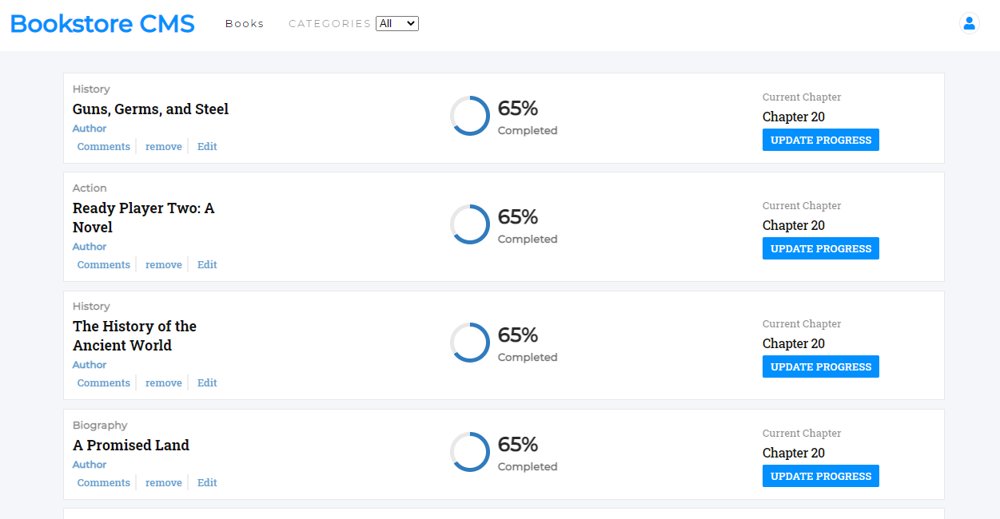

# Redux-Bookstore

It is a bookstore project that is build with react and redux. User can add book to the store by providing book title and the category where it belongs. This bookstore allows user to filter books based on category. User can also remove book from the store. In future, book progress and chapter tracker will be added to the store.

## Project Display



## Live Demo

[redux-bookstore](https://mysterious-reaches-46920.herokuapp.com/)

## Built With

- Html
- Css
- Vanila Js
- Atom text editor
- React Js
- redux
- react-redux
- Npm

# Getting Started

To get a local copy of the repository please run the following commands on your terminal:

```
$ cd <folder>
```

```bash

$ git clone `https://github.com/ajkacca457/redux-bookstore.git`
$ cd redux-bookstore
$ Run `npm install` to install the necessary modules
$ Run `npm run start` to open app in localhost.

```
# Authors

👤 **Avijit Karmaker**

- Github: [@Avijit](https://github.com/ajkacca457)
- Linkedin: [@Avijit](https://www.linkedin.com/in/avijit-karmaker-8738a54)

## 🤝 Contributing

Contributions, issues and feature requests are welcome!

## Show your support

Give a ⭐️ if you like this project!

## Copyright
This is a project developed by Avijit.
